---
## Front matter
title: "Первоначальна настройка git"
subtitle: "Лабораторная работа 2"
author: "Сорокин Кирилл Васильевич"

## Generic otions
lang: ru-RU
toc-title: "Содержание"

## Bibliography
bibliography: bib/cite.bib
csl: pandoc/csl/gost-r-7-0-5-2008-numeric.csl

## Pdf output format
toc: true # Table of contents
toc-depth: 2
lof: true # List of figures
fontsize: 12pt
linestretch: 1.5
papersize: a4
documentclass: scrreprt
## I18n polyglossia
polyglossia-lang:
  name: russian
  options:
	- spelling=modern
	- babelshorthands=true
polyglossia-otherlangs:
  name: english
## I18n babel
babel-lang: russian
babel-otherlangs: english
## Fonts
mainfont: PT Serif
romanfont: PT Serif
sansfont: PT Sans
monofont: PT Mono
mainfontoptions: Ligatures=TeX
romanfontoptions: Ligatures=TeX
sansfontoptions: Ligatures=TeX,Scale=MatchLowercase
monofontoptions: Scale=MatchLowercase,Scale=0.9
## Biblatex
biblatex: true
biblio-style: "gost-numeric"
biblatexoptions:
  - parentracker=true
  - backend=biber
  - hyperref=auto
  - language=auto
  - autolang=other*
  - citestyle=gost-numeric
## Pandoc-crossref LaTeX customization
figureTitle: "Рис."
tableTitle: "Таблица"
listingTitle: "Листинг"
lofTitle: "Список иллюстраций"
lolTitle: "Листинги"
## Misc options
indent: true
header-includes:
  - \usepackage{indentfirst}
  - \usepackage{float} # keep figures where there are in the text
  - \floatplacement{figure}{H} # keep figures where there are in the text
---

# Цель работы

Осовоение навыков работы с git

# Задание

Настроить git на пк, и выполнить действия с ним

# Теоретическое введение

Системы контроля версий (Version Control System, VCS) применяются при работе нескольких человек над одним проектом. Обычно основное дерево проекта хранится в локальном или удалённом репозитории, к которому настроен доступ для участников проекта. При внесении изменений в содержание проекта система контроля версий позволяет их фиксировать, совмещать изменения, произведённые разными участниками проекта, производить откат к любой более ранней версии проекта, если это требуется.

# Выполнение лабораторной работы

Укажем данные владельца git и зададим параметры(рис. [-@fig:001]).

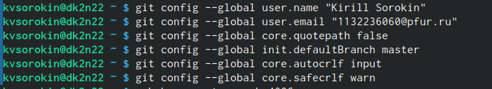{#fig:001 width=70%}

Создадим ssh ключ по алгоритму rsa размером 4096 бит(рис. [-@fig:002]).

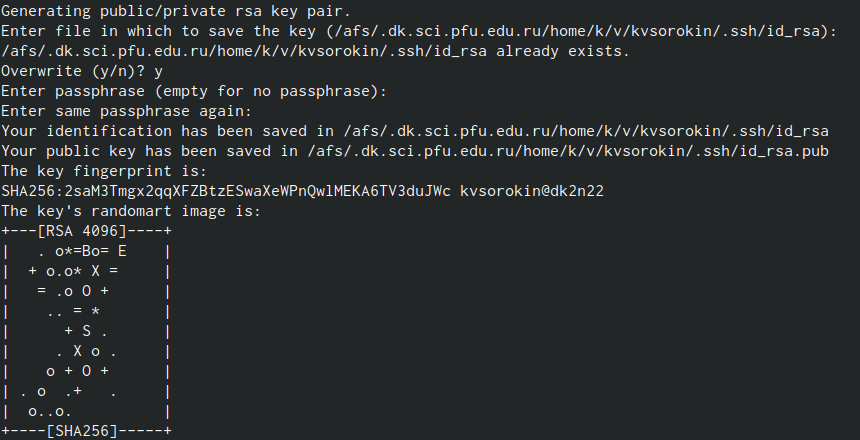{#fig:002 width=70%}

Теперь по алгоритму по алгоритму ed25519(рис. [-@fig:003]).

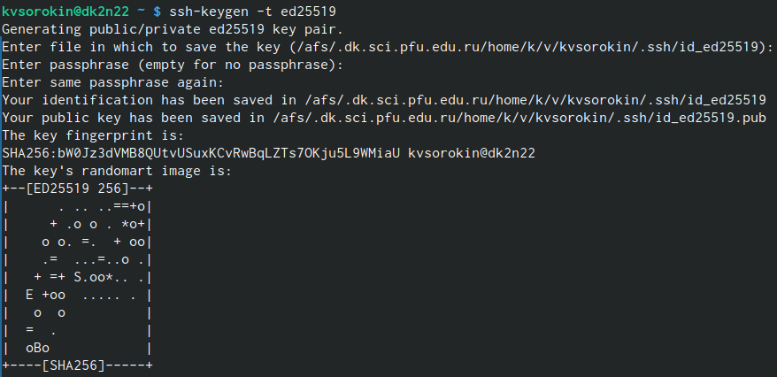{#fig:003 width=70%}

Создадим gpg ключ(рис. [-@fig:004]).

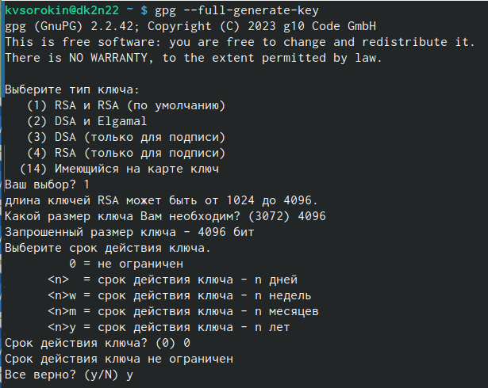{#fig:004 width=70%}

(к сожалению, на один скриншот не уместился весь процесс) (рис. [-@fig:005]).

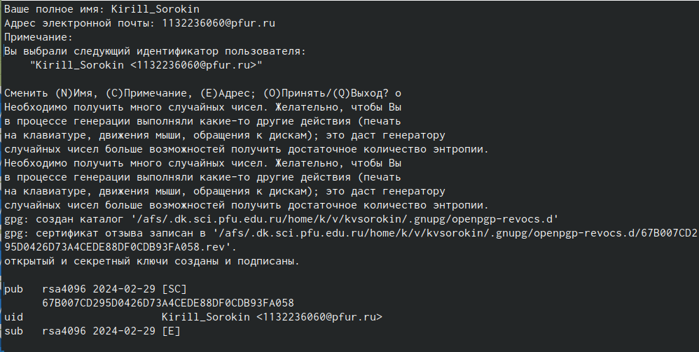{#fig:005 width=70%}

Выведем список gpg ключей (рис. [-@fig:006]).

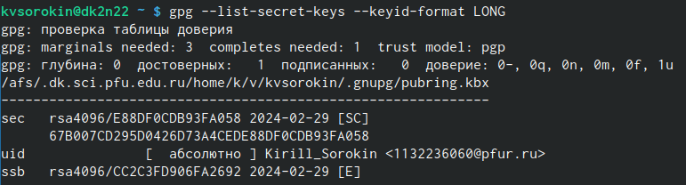{#fig:006 width=70%}

Скопируем ключ gpg в буфер обмена (рис. [-@fig:007]).

{#fig:007 width=70%}

Загрузим его на свой github (рис. [-@fig:008]).

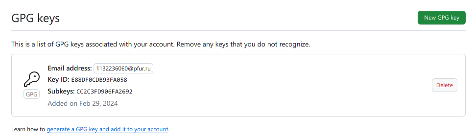{#fig:008 width=70%}

Сделаем настройку автоматических подписей коммитов git(рис. [-@fig:009]).

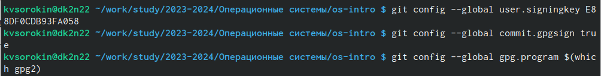{#fig:009 width=70%}

Авторизуемся в gh (рис. [-@fig:010]).

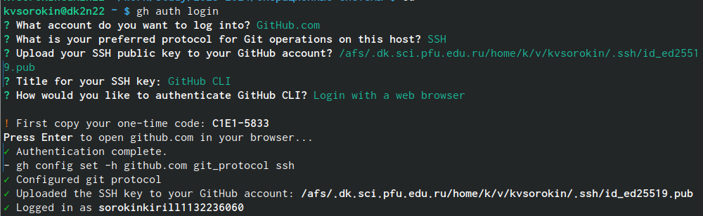{#fig:010 width=70%}

Настроим рабочее пространство под себя и клонируем репозиторий (рис. [-@fig:011]).

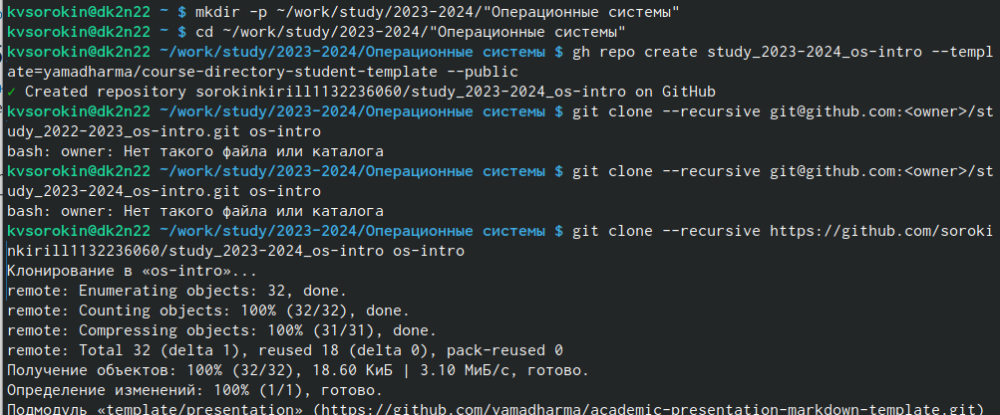{#fig:011 width=70%}

Теперь изменим данные в нашем скопированном репозитории (рис. [-@fig:012]).

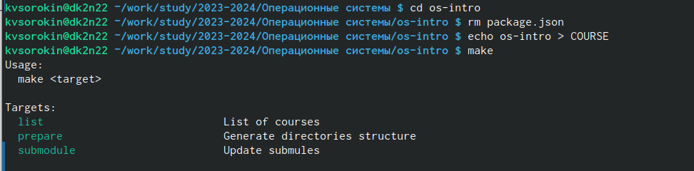{#fig:012 width=70%}

Выполним команду git add, git commit (рис. [-@fig:013]).

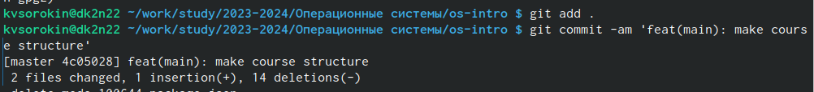{#fig:013 width=70%}

В завершение выполним git push, и заершим работу(рис. [-@fig:014]).

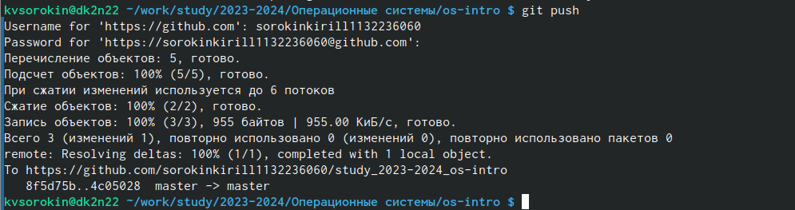{#fig:014 width=70%}

# Выводы

Мы научиличь базовой работе с гит

