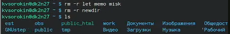

---
## Front matter
title: "Лабораторная работа 6"
subtitle: "Основы интерфейса взаимодействия пользователя с системой Unix на уровне командной строки"
author: "Сорокин Кирилл НММбд-03-23"

## Generic otions
lang: ru-RU
toc-title: "Содержание"

## Bibliography
bibliography: bib/cite.bib
csl: pandoc/csl/gost-r-7-0-5-2008-numeric.csl

## Pdf output format
toc: true # Table of contents
toc-depth: 2
lof: true # List of figures
fontsize: 12pt
linestretch: 1.5
papersize: a4
documentclass: scrreprt
## I18n polyglossia
polyglossia-lang:
  name: russian
  options:
	- spelling=modern
	- babelshorthands=true
polyglossia-otherlangs:
  name: english
## I18n babel
babel-lang: russian
babel-otherlangs: english
## Fonts
mainfont: PT Serif
romanfont: PT Serif
sansfont: PT Sans
monofont: PT Mono
mainfontoptions: Ligatures=TeX
romanfontoptions: Ligatures=TeX
sansfontoptions: Ligatures=TeX,Scale=MatchLowercase
monofontoptions: Scale=MatchLowercase,Scale=0.9
## Biblatex
biblatex: true
biblio-style: "gost-numeric"
biblatexoptions:
  - parentracker=true
  - backend=biber
  - hyperref=auto
  - language=auto
  - autolang=other*
  - citestyle=gost-numeric
## Pandoc-crossref LaTeX customization
figureTitle: "Рис."
tableTitle: "Таблица"
listingTitle: "Листинг"
lofTitle: "Список иллюстраций"
lolTitle: "Листинги"
## Misc options
indent: true
header-includes:
  - \usepackage{indentfirst}
  - \usepackage{float} # keep figures where there are in the text
  - \floatplacement{figure}{H} # keep figures where there are in the text
---

# Цель работы

Приобрести практических навыков взаимодействия пользователя с системой посредством командной строки

# Задание

Здесь приводится описание задания в соответствии с рекомендациями
методического пособия и выданным вариантом.

# Теоретическое введение

В операционной системе типа Linux взаимодействие пользователя с системой обычно осуществляется с помощью командной строки посредством построчного ввода команд. При этом обычно используется командные интерпретаторы языка shell: /bin/sh;/bin/csh; /bin/ksh.
Формат команды. Командой в операционной системе называется записанный по специальным правилам текст (возможно с аргументами), представляющий собой указание на выполнение какой-либо функций (или действий) в операционной системе.
Обычно первым словом идёт имя команды, остальной текст — аргументы или опции,конкретизирующие действие.
Общий формат команд можно представить следующим образом:
<имя_команды><разделитель><аргументы>

# Выполнение лабораторной работы

Создадим tmp и посмотрим его(рис. [-@fig:001]).

{#fig:001 width=70%}

Посмотрим ls через man (рис. [-@fig:002]).

{#fig:002 width=70%}

Посмотрим ls -a(рис. [-@fig:003]).

{#fig:003 width=70%}

Посмотрим ls -c (рис. [-@fig:004]).

{#fig:004 width=70%}

Посмотрим есть ли в spool cron (нет) (рис. [-@fig:005]).

{#fig:005 width=70%}

Перейдём в домашнюю директорию и посмотрим её содержимое(рис. [-@fig:006]).

{#fig:006 width=70%}

Выведим создателей файлов (рис. [-@fig:007]).

{#fig:007 width=70%}

Создадим newdir и в нём morefun (рис. [-@fig:008]).

{#fig:008 width=70%}

Создадим папки let memo misk и посмотрим есть ли они (рис. [-@fig:009]).

{#fig:009 width=70%}

Удалли всё что создали и проверим (рис. [-@fig:228]).

{#fig:228 width=70%}

Рекурсивно выведим все папки (рис. [-@fig:010]).

{#fig:010 width=70%}

Выведем папку в порядке созданияя файлов от новых к старым(рис. [-@fig:011]).

{#fig:011 width=70%}

Посмотрим наши команды командой history (рис. [-@fig:012]).

{#fig:012 width=70%}

# Выводы

Мы научились использовать систему с помощью командоной строки

